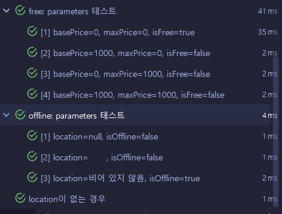
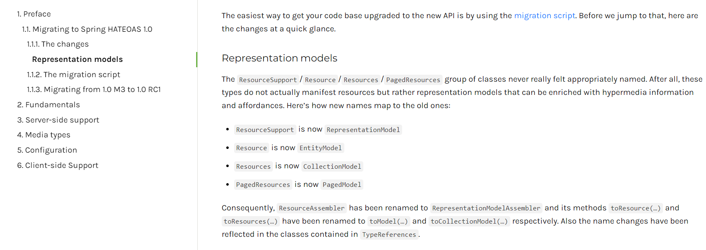
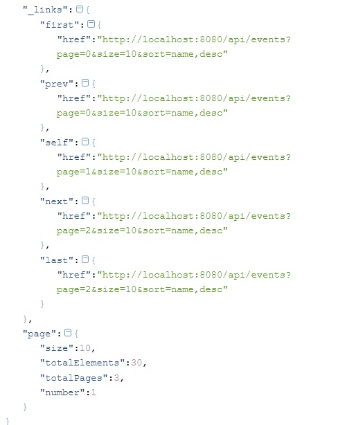
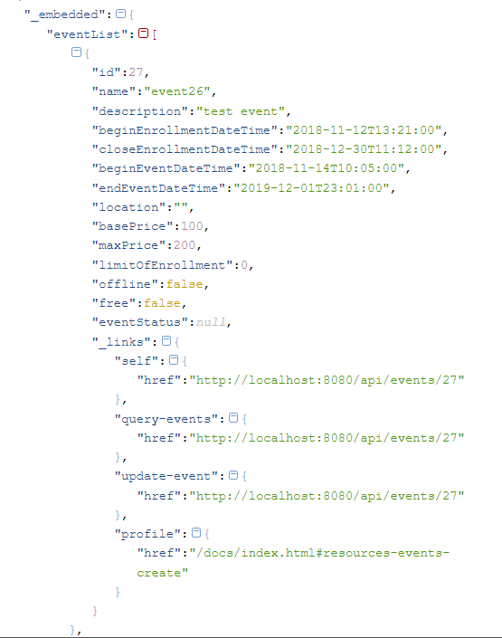
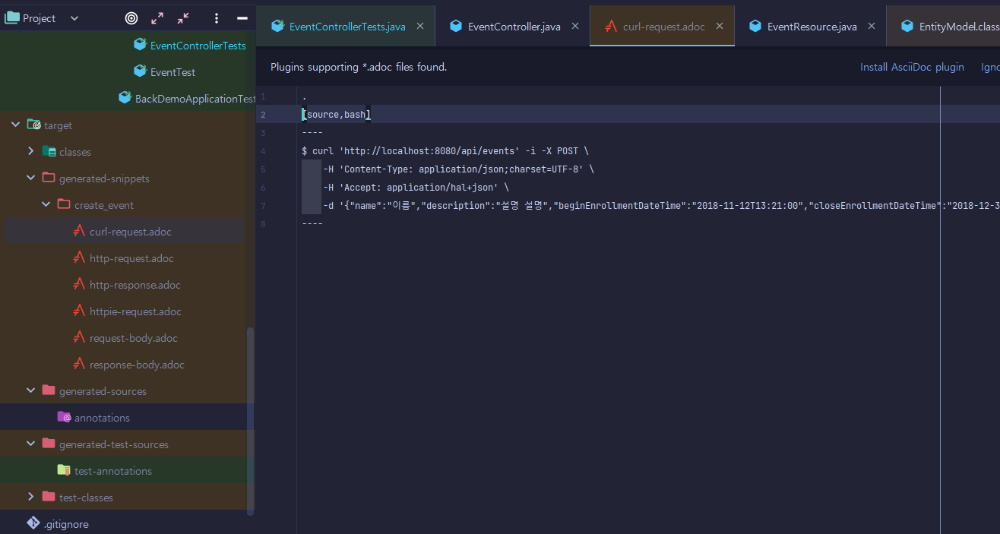
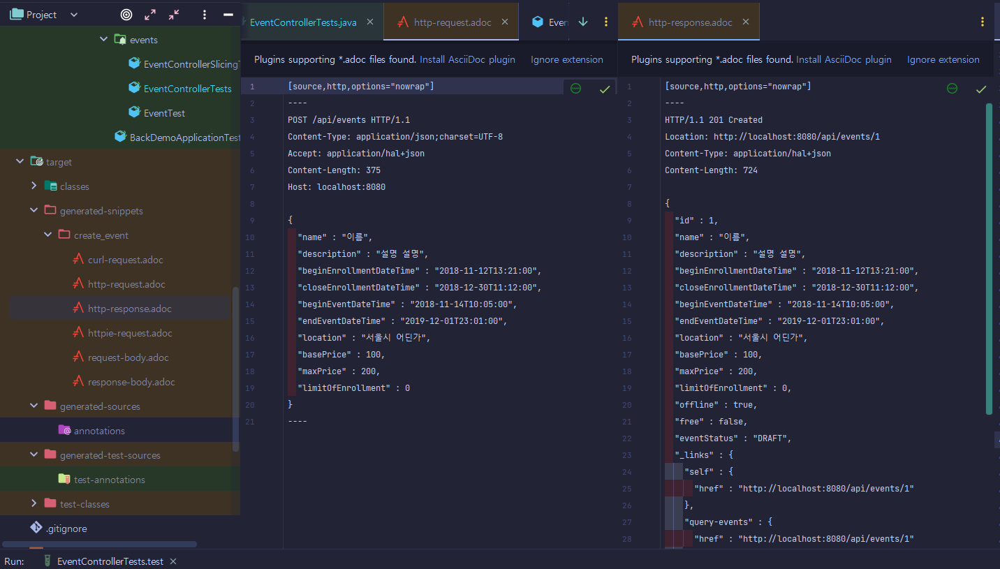
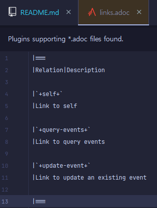
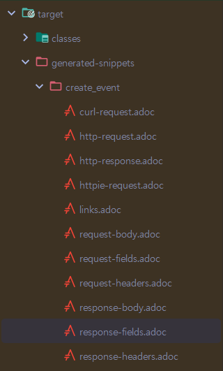

# springBootBack
from inflearn(https://www.inflearn.com/course/spring_rest-api)
### using Dependencies
java 11, spring boot 2.x.x(maven), postgresql(with docker), h2(test), JPA, Lombok, restdocs

# I. 강의 개요
2017년 네이버의 Deview 컨퍼런스에서 이응준님의 발표에서 영감을 받음. 현재 REST API라 불리고 쓰이는 것들이 과연 RestFUL한가에 대한 의문. 진짜 REST API 만들기
## A. 로이 필딩이 정의한 REST: REpresentational State Transfer
인터넷 상의 시스템 간의 상호 운용성(interoperability)을 제공하는 방법중 하나 
```markdown
    REST API: REST 아키텍처 스타일을 따르는 API
        Client-Server
        Stateless
        Cache
        Uniform Interface
            Identification of resources
            manipulation of resources through representations
            self-descriptive messages : response만으로도 의미가 명확(설명을 위한 링크가 포함된다거나 Content-type header가 명확…)해야하고
            hypermedia as the engine of application state (HATEOAS) : 이후 움직임을 위한 미디어(url)을 포함해야한다
        Layered System
        Code-On-Demand (optional)
```
특히 self-descriptive messages와 HATEOAS가 무시되고 있음
## B. 이에 대한 대안
1. 미디어 타입을 구체적으로 정의 > IANA 등록 > 해당 타입을 resource로 전달할때 Content-type 헤더에 기록: 브라우저들마다 스펙 지원이 달라 처리가 안될 수 있음
2. profile 링크 헤더 추가 : 브라우저들마다 스펙 지원이 달라 처리가 안될 수 있음
3. 2에 대한 대안 : 헤더의 HAL에 링크 데이터로 profile 링크 추가

참고: https://docs.github.com/en/free-pro-team@latest/rest/issues/issues?apiVersion=2022-11-28#update-an-issue

# II. Spring boot 관련
## A. Annotation 처리 결과 보기: target 폴더
target 폴더에 생성된 class들을 보면 어노테이션으로 넘어간 method, data, constructor 등의 결과를 직접 확인할 수 있다.
## B. @EqualsAndHashCode(of= {"id", "name"}) / @EqualsAndHashCode(of= "id")
equals와 hashcode 비교 메서드 처리시 입력한 값을 기준으로만 해당 객체 비교. 단, 연관관계가 있는 데이터가 있는 경우에는 구현체에서 서로 무한 비교하다가 stackOverFlow가 발생할 수 있어 사용 x
## C. Entity에 @Data를 쓰지않는 이유
@Data에는 아래의 어노테이션을 모두 포함하지만 @EqualsAndHashCode는 모든 properties를 검색하도록하므로 stack over flow를 발생시킬 수 있다.
```java
    @Builder
    @AllArgsConstructor
    @NoArgsConstructor
    @Getter
    @Setter
    @EqualsAndHashCode(of= "id") //지정해서 사용할 것을 권장
```
## D. URI 조형하기
```java
    // 그냥 생성자로 만들기
    URI createdUri = linkTo(EventController.class).slash("{id}").toUri();
    // 해당 entity의 method 사용
    URI createdUri = linkTo(methodOn(EventController.class).createEvent()).slash("{id}").toUri();
```
## C. ResponseEntity의 body에 객체 넣기
```java
    return ResponseEntity.created(createdUri).body(event);//.build() 대신 body() 사용
```
## D. JPA로 repository 만들기: 인터페이스로 상속받아서 구현 처리
```java
    public interface EventRepository extends JpaRepository<Event,Integer> 
```
## E. entity validation 관리
    - Jacksons library를 사용
    - Entity에 validation 관련 어노테이션 사용(편리하지만 코드가 복잡해짐)
    - 입력값을 받는 DTO를 따로 생성해서 관리(권장하지만 중복코드 발생)
        dto를 따로 생성함으로써 받지 않을 데이터(id, free 등 연산으로 만들거나 내부에서 관리할 데이터)는 거를 수 있다.
## F. DTO에서 Entity로 만드는 방법 : 
### 1. 새로 빌드하기(생성하기) : 속도가 빠르고 안정성이 높음
```java
    Event unpersistEvent = Event.builder()
            .name(eventDto.getName())
            .description(eventDto.getDescription())
            .location(eventDto.getLocation())
            .beginEventDateTime(eventDto.getBeginEventDateTime())
                ...
            .build();
```
### 2. 라이브러리 사용: ModelMapper / reflection 발생 가능성 있음
dependency 주입
```xml
    <!-- https://mvnrepository.com/artifact/org.modelmapper/modelmapper -->
    <dependency>
        <groupId>org.modelmapper</groupId>
        <artifactId>modelmapper</artifactId>
        <version>2.4.5</version>
    </dependency>
```

공용으로 사용하는 경우가 많으므로 bean 생성
```java
    @Bean
    public ModelMapper modelMapper(){
        return new ModelMapper();
    }
```

사용할 곳에서 injection 후 사용
```java
    private final ModelMapper modelMapper;
        ...
    Event event = modelMapper.map(eventDto,Event.class);
```

## G. BadRequest:400 처리하기
### 1. 불필요한 값이 전달된경우 fail response 처리하기
불필요한 값을 무시할지 체크할지 개발자가 결정
ModelMapping library를 사용하는 경우 설정만 변경(application.yml/properties)
```yaml
    spring:
        jackson:
            deserialization:
                fail-on-unknown-properties: true # mapping 과정에서 불필요가 있는경우 fail 처리
```
### 2. Spring MVC 기능 이용하기
a. 값이 없는 경우 :controller에 @Valid 삽입, param으로 Error 객체 받음
```java
    @PostMapping
    public ResponseEntity createEvent(@RequestBody @Valid EventDto eventDto, Errors errors){
        if(errors.hasErrors()){
            return ResponseEntity.badRequest().build();
        }
        ...
```

parameter로 사용하는 DTO에서 validation의 어노테이션 사용
```java
    @NotEmpty //String은 Empty
    private String name;
    @NotNull //값은 null
    private LocalDateTime endEventDateTime; // 종료 시간
    private String location; //optional
    @Min(0)
    private int basePrice; // optional이지만 양수
```

### 3. customized validation bean (만들어서 사용)
컴포넌트를 새로 작성하고
```java
    @Component
    public class EventValidation {
        public void validate(EventDto eventDto, Errors errors){
            if(eventDto.getBasePrice() > eventDto.getMaxPrice() && eventDto.getMaxPrice() > 0){
                errors.rejectValue("basePrice","wrong input value","basePrice can't be larger than maxPrice");
                errors.rejectValue("maxPrice","wrong input value","maxPrice can't be smaller than basePrice and 0");
            }
        }
    }
```

reject 두 종류: method에 따라 Errors 객체에 입력되는 위치(properties)가 달라진다.

reject() : globalError의 property
```java
errors.reject("globalError","just globalError test");
```
rejectValue() : fieldError의 property(주로 사용)
```java
errors.rejectValue("endEventDateTime","0001","endEventDateTime must be before other dateTimes");
```
컨트롤러에서 적용
```java
    public class EventController {
    
        private final EventRepository eventRepository;
        private final ModelMapper modelMapper;
        private final EventValidation eventValidation;
    
        @PostMapping
        public ResponseEntity createEvent(@RequestBody @Valid EventDto eventDto, Errors errors){
            eventValidation.validate(eventDto,errors);
            if(errors.hasErrors()){
                return ResponseEntity.badRequest().build();
            }
            ...
```
### 4. 에러 응답 메세지 본문 만들기
ResponseEntity 객체의 body에 삽입해 client가 원인을 확인하도록 함

but, java bean 규칙에 따른 properties를 갖는 Event 객체와 달리 errors는 에러를 발생한다.(아래와 같이 불가)

JSON으로 변환시킬때 ObjectMapper의 beanSerializer()를 쓰는데 이때 문제가 발생한다.
```java
    if(errors.hasErrors()){
        return ResponseEntity.badRequest().body(errors); 
    }
```
변환용 class를 생성해 bean 등록: springboot 2.3이후로는 Array부터 만드는게 불가함. JsonArray는 

```java
    @JsonComponent //Spring boot에서 제공
    public class ErrorsSerializer extends JsonSerializer<Errors> {//JSON String으로 변환할 대상 지정
        @Override
        public void serialize(Errors errors, JsonGenerator gen, SerializerProvider serializers) throws IOException {
            Logger logger = LoggerFactory.getLogger(getClass());
            gen.writeFieldName("errors");//spring boot 2.3부터 Jackson library가 더이상 Array부터 만드는 것을 금지함
            gen.writeStartArray(); // start generating error Array
            errors.getFieldErrors().forEach(e->{
                try{
                    gen.writeStartObject(); //start generating Errors Object
                    gen.writeStringField("field", e.getField());
                    gen.writeStringField("objectName", e.getObjectName());
                    gen.writeStringField("code", e.getCode());
                    gen.writeStringField("defaultMessage", e.getDefaultMessage());
                    Object rejectedValue = e.getRejectedValue();
                    if (rejectedValue != null) {
                        gen.writeStringField("rejectedValue", rejectedValue.toString());
                    }
                    gen.writeEndObject(); // finish generating Errors Object
                }catch (IOException ie){
                    logger.error(ie.getMessage());
                }
            });
            errors.getGlobalErrors().forEach(error->{
                ...
            });
            gen.writeEndArray(); // end generating error Array
        }
    }
```
변환 처리 후 controller의 ....body(errors);처리
### 5. 에러 응답 메세지 본문 만들기
에러때 event api의 index로 이동시키기
1. index 응답용 api
```java
@RestController
@RequiredArgsConstructor
@RequestMapping("/api")
public class IndexController {
    @GetMapping
    public RepresentationModel index(){
        var index= new RepresentationModel();
        index.add(linkTo(EventController.class).withRel("events"));
        return index;
    }
}
```
2. 해당 api를 응답resource로 만들 ErrorResource 구현
```java
public class ErrorResource extends EntityModel<Errors> {
    public ErrorResource(Errors errors, Link... links){
        super(errors, Arrays.asList(links));
        add(linkTo(methodOn(IndexController.class).index()).withRel("index"));
    }
}
```
3. 해당 에러 처리 과정에 추가
```java
    //controller validation part
  if(errors.hasErrors()){
      return badRequest(errors);
  }
  
  //use private method
  private static ResponseEntity<ErrorResource> badRequest(Errors errors) {
      return ResponseEntity.badRequest().body(new ErrorResource(errors));
  }
```
4. test code
```java
  .andExpect(jsonPath("errors[0].defaultMessage").exists())
  .andExpect(jsonPath("errors[0].rejectedValue").exists())
  .andExpect(jsonPath("_links.index").exists()) //error때 이동할 api index
```
## H. Not Found 404 에러
notFound의 경우 body를 처리할 method가 없어 생성자를 작성해 body를 작성할 수 있음.

```java
    private ResponseEntity<ErrorResource> notFound(Errors errors){
        ErrorResource errorResource=new ErrorResource(errors);
        return new ResponseEntity(errorResource,HttpStatus.NOT_FOUND);
    }
```
그것 없이 헤더만 사용해도됨
```java
    @GetMapping("/{id}")
    public ResponseEntity getEvent(@PathVariable Integer id){
        Optional<Event> optionalEvent = this.eventService.getEvent(id);
        if(optionalEvent.isEmpty()){
            return ResponseEntity.notFound()/*.header("headerName", "headerValue")*/.build();
        }
        Event event = optionalEvent.get();
        EventResource eventResource = new EventResource(event);
        return ResponseEntity.ok().body(eventResource);
    }
```
# III. 비즈니스 로직 관련
## A. Event API 비즈니스 로직
### 1. parameters
```markdown
  - name
  - description
  - beginEnrollmentDateTime
  - closeEnrollmentDateTime
  - beginEventDateTime
  - endEventDateTime
  - location
  - basePrice
  - maxPrice
  - limitOfEnrollment
```
### 2. price 로직
```markdown
    base    max     logic
    0       100     선착순
    0       0       무료
    100     0       무제한 경매
    100     100     선착순 경매(순위꿘)
```
### 3. response data
```markdown
    id
    name
        ...
    limitOfEnrollment
    eventStatus
    offline
    free
    _links
        profile
        self
        publish
            ...
```

# IV. 테스트 관련
## A. TDD 방식
### 1. 요구사항 확인 및 구조 분석
### 2. 개발 순서 구조화
### 3. 순차적으로 진행
```markdown
> 해당 단위 test 코드 작성
> test 실패 확인
> 해당 코드 적용
> 해당 단위를 포함하는 class 전체 테스트
> refecter
> 다음 단위 작성 ... 반복
```
[TDD](https://ko.wikipedia.org/wiki/%ED%85%8C%EC%8A%A4%ED%8A%B8_%EC%A3%BC%EB%8F%84_%EA%B0%9C%EB%B0%9C#/media/%ED%8C%8C%EC%9D%BC:TDD_Global_Lifecycle.png)

## B. 단위 테스트
가장 작은 단위(method 구현을 위한 테스트)
```java
    @Test
    void 빌드확인(){
        //given
        //when
        Event event = Event.builder()
                .name("Inflearn Spring Boot")
                .description("REST API development with Spring boot")
                .build();
        //then
        assertThat(event).isNotNull();
    }
```
## C. 웹 계층 테스트
단위테스트만큼 가볍지는 않지만 웹 계층의 이벤트와 request, response 등을 처리함. 서버는 띄우지 않지만 dispatcherServlet까지는 띄움
```java
    @WebMvcTest // MockMvc를 주입받아 사용
    class EventControllerTests {
        @Autowired
        MockMvc mockMvc; //웹과 같은 환경으로 테스트(계층별 테스트: slicing test)
        @Autowired
        ObjectMapper objectMapper;// json으로 변환
        @MockBean // 이 bean을 MockBean으로 만들어 줌.
        EventRepository eventRepository;//repository는 webBean이 아니어서 주입되지 않음
    
        ...data...
   
        @Test
        void createEvent() throws Exception {
            
                mockMvc.perform( post("/api/events")//HTTPRequestServlet Method
                    .contentType(MediaType.APPLICATION_JSON) // request 구체적 구현
                    .accept(MediaTypes.HAL_JSON) // HAL JSON response 요구
                    .content(objectMapper.writeValueAsString(event))// object를 JsonString으로 변환
                )
                .andDo(print())//결과 프린팅
                .andExpect(status().isCreated()) //isCreated: 201
                .andExpect(jsonPath("id").exists());//연속적으로 데이터 확인 가능
            }
        }
    }
```
## D. TDD 진행시 주의사항
### 1. 가능한 정해진 variable을 사용한다
하드코딩은 최소화하고 변수를 사용. 가능하다면 기존 데이터를 쓰는것을 권장
```java
    .andExpect(header().exists(HttpHeaders.LOCATION)) //"location"보다는 HttpHeaders.Location
    .andExpect(header().string(HttpHeaders.CONTENT_TYPE, MediaTypes.HAL_JSON_VALUE))\
```
### 2. TDD는 보통 데이터 3개 정도를 넣고 진행
테스트를 진행할때는 데이터 여러개를 테스트
```java
import java.util.Stream.IntStream;

    IntStream.range(0,10).forEach(this::EventResource);
```
### 3. Test 진행시 test 명칭 변경하기
#### a. 테스트 코드의 명칭을 직접 변경(한글도 가능) 단, 띄어쓰기 불가
```java
    @Test
    void 빌드확인(){
        //given
        //when
        Event event = Event.builder()
                .name("Inflearn Spring Boot")
                .description("REST API development with Spring boot")
                .build();
        //then
        assertThat(event).isNotNull();
    }
```
#### b. Junit5인경우: @DisplayName(value) 사용하기
```java
    @Test
    @DisplayName(value = "정상 처리된 경우 확인")
    void createEvent() throws Exception {
        //given
        EventDto event = EventDto.builder()
        ...
```
#### c. Junit4인경우: 직접 test용 description 작성하기
```java
    @Target(ElementType.METHOD) // 대상
    @Retention(RetentionPolicy.SOURCE) // life cycle
    public @interface TestDescription {
        String value(); //입력값.
        String useDefault() default "a"; //기본값을 지정하는 경우
    }
```

작성 후 test에서 사용주석 대신 사용... test 코드는 그대로 나옴
```java
    @Test
    @TestDescription(value = "잘못된 값이 입력 됐을때 response code 체크")
    void createEvent_BadRequest_WrongData() throws Exception{
```
Junit 5 사용을 권장.

### 4. 전달된 json 값 확인하기
error메세지 확인용 test : errors 객체에 배열로 들어있음 그중 첫 데이터만 확인
```java
    mockMvc.perform(post("/api/events")
                    .contentType(MediaType.APPLICATION_JSON)
                    .accept(MediaTypes.HAL_JSON)
                    .content(objectMapper.writeValueAsString(eventDto))
            )
            .andExpect(status().isBadRequest())
            .andExpect(jsonPath("$[0].objectName").exists())
            .andExpect(jsonPath("$[0].field").exists())
            .andExpect(jsonPath("$[0].defaultMessage").exists())
            .andExpect(jsonPath("$[0].code").exists())
            .andExpect(jsonPath("$[0].rejectedValue").exists())
            .andDo(print());
```
### 5. parameter 변경에 따른 테스트인 경우 중복이 많을 수 있다. 이때 쓰면 좋은 library
junit4 일때 [여기](https://www.baeldung.com/junit-params) /
junit5 일때 [여기](https://mvnrepository.com/artifact/org.junit.jupiter/junit-jupiter-params)

주의!! junit 버전과 일치 확인
```java
    @ParameterizedTest
    @MethodSource("testFree_useParams")
    @DisplayName(value = "free: parameters 테스트")
    void paramsForFree(int basePrice, int maxPrice, boolean isFree){
        // given
        Event event = Event.builder()
                .basePrice(basePrice)
                .maxPrice(maxPrice)
                .build();

        // when
        event.update();

        // then
        assertThat(event.isFree()).isEqualTo(isFree);
    }
    //테스트 설정
    private static Stream<Arguments> testFree_useParams(){
        int free = 0;
        int pay = 1000;
        boolean isFree = true;
        return Stream.of(
                Arguments.of(free,free,isFree),
                Arguments.of(pay,free,!isFree),
                Arguments.of(free,pay,!isFree),
                Arguments.of(pay,pay,!isFree)
        );
    }
```

수행결과

## E. MockMvc를 사용할때 데이터 처리
### 1. queryParam 테스트: 요청할때 param추가
```java
    @Test
    @DisplayName(value="30개의 이벤트를 10개씩 조회 - 2page")
    void queryEvents() throws Exception{
        //given
        IntStream.range(0,30).forEach(this::generateEvent);
/**
*         IntStream.range(0,30).forEach(i->{
*             this.generateEvent(i);
*         });
*/
        //when
        this.mockMvc.perform(get("/api/events")
                        .param("page","1")//paging data
                        .param("size","10")
                        .param("sort","name,DESC")
                )
                .andDo(print())
                .andExpect(status().isOk())
                .andExpect(jsonPath("page").exists()) //Pageable을 사용한 경우
        ;
        //then
    }

    private void generateEvent(int i) {
        Event event = Event.builder()
                .name("event"+i)
                    ...
                .location("서울시 어딘가")
                .build();
        this.eventRepository.save(event);
    }
```
### 2. pathVariable을 사용하는 경우
```java
    @Test
    @DisplayName(value="기존 이벤트 중 하나 조회하기")
    void getEventOne() throws Exception{
        //given
        Event event = this.generateEvent(100);
        //when
        ResultActions perform = this.mockMvc.perform(get("/api/events/{id}",event.getId()));
        //then
        perform.andDo(print())
                .andExpect(jsonPath("id").exists())
        ;
    }
```
### 3. request의 body에 넣는 경우
컨텐츠 타입을 설정 한 후 content에 대입
```java
    @Test
    @DisplayName(value = "업데이트할때 값이 빈 경우")
    void updateNullData()throws Exception{
        //given
        Event originEvent = this.generateEvent(100);
        //when
        EventDto eventDto = new EventDto();
        ResultActions perform = this.mockMvc.perform(put("/api/events/{id}", originEvent.getId())
                .contentType(MediaType.APPLICATION_JSON)
                .accept(MediaTypes.HAL_JSON_VALUE)
                .content(objectMapper.writeValueAsString(eventDto))
        );
        //then
        perform.andExpect(status().isBadRequest()).andDo(print());
    }
```
## F. TEST code refactoring tips
### 1. 테스트 클래스들의 중복 어노테이션 줄이기: 상속
아래와 같이 유사한 테스트들마다 어노테이션이 반복된다.
```java
@SpringBootTest
@AutoConfigureMockMvc 
@AutoConfigureRestDocs 
@Import(RestDocsConfiguration.class)
@ActiveProfiles("test")
```
이를 위해 유사한 테스트에서는 반복코드를 최소화 하도록 상속으로 이어준다. 
#### a. test폴더의 common package에 해당 유형의 class 생성
#### b. 기존 테스트의 annotation 가져와서 붙여넣기
```java
@SpringBootTest
@AutoConfigureMockMvc
@AutoConfigureRestDocs
@Import(RestDocsConfiguration.class)
@ActiveProfiles("test")
//@Ignore Junit4에서
@Disabled //Junit5
public class WebMockControllerTest {

}

```
#### c. 유사 테스트에서 사용될 의존성들을 미리 주입
```java
...
public class WebMockControllerTest {
    @Autowired
    protected MockMvc mockMvc;
    @Autowired
    protected ModelMapper modelMapper;
    @Autowired
    protected ObjectMapper objectMapper;
}

```
#### d. 준비된 데이터들을 기존 test class에서 지우고 상속
```java
class EventControllerTests extends WebMockControllerTest {
    @Autowired //이테스트에서만 쓰는 경우는 남김
    EventRepository eventRepository;
    @Test
    @DisplayName(value = "정상 처리된 경우 확인")
    void createEvent() throws Exception { 
        ...
```
# V. 유용한 라이브러리
## A. Spring HATEOAS library
스프링에서 RestFul Api을 더 잘 구성하도록 돕는 라이브러리.
Spring boot의 도움으로 별도의 어노테이션이나 설정 없이 사용가능

```asciidoc
    HATEOAS: 수신된 response만으로도 app과 client 사이의 동작을 동적으로 소통할 수 있는 상태. (rest api)
```
[HATEOAS 문서](https://docs.spring.io/spring-hateoas/docs/current/reference/html/)

[이 프로젝트에서 쓰고있는 버전](https://docs.spring.io/spring-hateoas/docs/1.0.1.RELEASE/reference/html/)

### 1. 핵심 기능
```markdown
a. 링크를 만드는 기능 
    - 문자열로 생성
    - 생성 메서드(LinkTo method)
b. 리소스를 만드는 기능
    - resources data + link
c. 링크를 찾아주는 기능
    - Traberison
    - LinkDiscovers
```
### 2. 링크에 들어가야할 정보
```markdown
- HREF  : link
- REL   : 현재 정보와의 관계 - self, profile, transfer, update, query-event, withdraw, ... etc.
```
### 3. 버전에 따라 클래스 명이 달라짐을 주의


### 4. resource 사용하기
#### a. 방법 1 :  RepresntationModel(구 ResourceSupport)
RepresentationModel(구 ResourceSupport) 사용: Entity를 eventResource로 만들때 적용
```java
    public class EventResource extends RepresentationModel {
        @JsonUnwrapped
        private Event event;
        public EventResource (Event event){
            this.event = event;
            eventResource.add(linkTo(EventController.class).withRel("query-events"));
            eventResource.add(selfLinkBuilder.withSelfRel());)
            eventResource.add(selfLinkBuilder.withRel("update-event"));//HttpMethod 차이일뿐 링크는 같을 수 있음)
        }
        public Event getEvent() {
            return event;
        }
    }
```
* @JsonUnwrapped : entity를 분해해서 내부 내용을 입력하게함(별도로 setter과정 생략)

controller에서 사용
```java
//        ControllerLinkBuilder
  WebMvcLinkBuilder selfLinkBuilder = linkTo(EventController.class).slash(newEvent.getId());
  URI createdUri = selfLinkBuilder.toUri();
  EventResource eventResource = new EventResource(event);
  //new Link("url")도 가능:         add(new Link("http://localhost:8181/api/events/"+event.getId()));
  //데이터가 변경되면 하나하나 직접 변경해야흐므로 아래를 권장
  eventResource.add(linkTo(EventController.class).withRel("query-events"));
  eventResource.add(selfLinkBuilder.withSelfRel());)
  eventResource.add(selfLinkBuilder.withRel("update-event"));//HttpMethod 차이일뿐 링크는 같을 수 있음)
  return ResponseEntity.created(createdUri).body(eventResource);
```
#### b. 방법 2 : EntityModel(구 Resource) 사용하기
RepresentationModel와 달리 EntityModel은 별도로 JsonUnWrappted annotation을 사용하지 않아도 매핑됨.
```java
import org.springframework.hateoas.EntityModel;
import org.springframework.hateoas.Link;

import java.util.Arrays;

public class EventResource extends EntityModel<Event> {
    public EventResource(Event content, Link... links){
        super(content, Arrays.asList(links));
        // 컨트롤러가 아닌 resource의 생성 단계에서 추가도 가능(권장)
        
    }
}
```

## B. Spring data JPA
### 1. org.springframework.data.domain.Pageable
라이브러리가 제공하는 Pageable class로 paging에 필요한 기본 정보를 parameter로 받을 수 있다.
#### a. controller에서 Pageable로 받기
```java
    @GetMapping
    //Pageable로 paging에 필요한 parameter를 받음(Spring data JPA가 제공)
    public ResponseEntity queryEvents(Pageable pageable){
        return ResponseEntity.ok(this.eventService.queryEvents(pageable));
    }
```
#### b. service에서 repository로 처리
findAll에서 pageable을 받아 Page 객체로 전달
```java
    public Page<Event> queryEvents(Pageable pageable){
        return eventRepository.findAll(pageable);
    }
```
#### c. page 관련 정보를 resource의 형태로 제공
이전페이지, 이후 페이지의 링크, 관련 정보를 resource로 전달
```java
    public ResponseEntity queryEvents(Pageable pageable, PagedResourcesAssembler<Event> pagedResourcesAssembler){
        Page<Event> page = this.eventService.queryEvents(pageable);
        //assembler 사용 > resource(지금은 EntityModel)
        PagedModel<EntityModel<Event>> pageEntityModel = pagedResourcesAssembler.toModel(page);
        return ResponseEntity.ok(pageEntityModel);
    }
```
#### d. response data


page 객체를 전달하면 pageable로 표시되고 링크는 전달되지 않는다.

#### e. 각각의 데이터(event)마다 접근할 수 있는 링크생성(HATEOAS 만족)
```java
    @GetMapping
    public ResponseEntity queryEvents(Pageable pageable, PagedResourcesAssembler<Event> pagedResourcesAssembler){
        Page<Event> page = this.eventService.queryEvents(pageable);
        //각 event마다 eventResource 적용
        PagedModel<EntityModel<Event>> pageEntityModel = pagedResourcesAssembler.toModel(page,e -> new EventResource(e));
        //var pageEntityModel = pagedResourcesAssembler.toModel(page, EventResource::new);로 축약 가능
        return ResponseEntity.ok(pageEntityModel);
    }
```
- test
```java
  .andExpect(jsonPath("page").exists()) //paging data
  .andExpect(jsonPath("_links").exists()) //paging link
  .andExpect(jsonPath("_embedded.eventList[0]._links.self").exists())//개별 link
```
- response
  

#### f. 자체 프로필 문서 작성 후 profile 링크 추가
entityModel(resource)이 만들어졌다면 바로 링크 추가하면 됨
```java
  pageEntityModel.add(Link.of("/docs/index.html#resources-query-events").withRel("profile"));
```
하위요소가 있는 경우의 문서화(array 등)
```java
                .andDo(document("query-events",
                        links(
                                linkWithRel("first").description("Link to first page"),
                                linkWithRel("prev").description("Link to previous page"),
                                linkWithRel("self").description("Link to self"),
                                linkWithRel("next").description("Link to next page"),
                                linkWithRel("last").description("Link to last page"),
                                linkWithRel("profile").description("Link to profile page")
                        ),
                        responseHeaders(
                                headerWithName(HttpHeaders.CONTENT_TYPE).description("contentType"+MediaTypes.HAL_JSON_VALUE)
                        ),
                        responseFields(
                                subsectionWithPath("_embedded").description("An array of events"),//여러 요소를 포함한 객체인 경우
                                subsectionWithPath("_embedded.eventList").ignored(),//array 등 을 대상으로 하위 요소를 무시할 경우
                                //page data
                                fieldWithPath("page.size").description("page size is 10 rows"),
                                fieldWithPath("page.totalElements").description("total number"),
                                fieldWithPath("page.totalPages").description("total pages"),
                                fieldWithPath("page.number").description("index of page"),
                                //link data
                                fieldWithPath("_links.first.href").description("Link to first page").optional(),
                                fieldWithPath("_links.prev.href").description("Link to previous page").optional(),
                                fieldWithPath("_links.self.href").description("Link to self").optional(),
                                fieldWithPath("_links.next.href").description("Link to next page").optional(),
                                fieldWithPath("_links.last.href").description("Link to last page").optional(),
                                fieldWithPath("_links.profile.href").description("Link to profile page").optional()
                        )
                ));
```
## C. Spring REST DOCS
### 1. REST DOCS 소개
RESTful API의 문서를 제작하는데 도움을 주는 tool

test에서 체크한 정보를 모아서 snippets을 제공해 docs html을 만들 수 있음

자주 사용하는 문서 관련 tools
```markdown
    Swagger는 코드 자체에서 문서화
    Rest docs는 테스트에서 문서화
    Postman은 API의 연결정보 확인에 유용
```
최소 사용 환경:
```markdown
    java 8
    Spring Framework 5.0.2 
```
아래의 tool을 사용 :
```markdown
    MockMVC
    WebTestClient
    REST Assured
    Slate
    TestNG
    JUnit5
```
방법:
- 일반 Spring: mockMvc 객체 생성시 .apply(documentationConfiguration(this.restDocumentation))을 넣고 build()
- SpringBoot: @AutoConfigureRestDocs를 테스트 class 위에 적용
```java
    @AutoConfigureRestDocs // REST Docs용
    class EventControllerTests {
```
- 해당 테스트에 andDo()로 스니펫 작성
```java
    .andDo(document("create_event")) ...
```
결과 : ASCII Docs으로 이뤄진 html 문서


### 2. 구체적 사용
#### a. REST DOCS form 설정하기: RestDocsConfigure class test 폴더에..
설정 class
```java
    import org.springframework.boot.test.autoconfigure.restdocs.RestDocsMockMvcConfigurationCustomizer;
    import org.springframework.boot.test.context.TestConfiguration;
    import org.springframework.context.annotation.Bean;
    import org.springframework.restdocs.mockmvc.MockMvcRestDocumentationConfigurer;
    
    @TestConfiguration // test 관련 설정임을 알림
    public class RestDocsConfiguration {
        @Bean
        public RestDocsMockMvcConfigurationCustomizer restDocsMockMvcConfigurationCustomizer(){
            return new RestDocsMockMvcConfigurationCustomizer() {
                @Override
                public void customize(MockMvcRestDocumentationConfigurer configurer) {
                    //여기까지는 자동생성. configurer를 정의
                    configurer.operationPreprocessors() // 처리과정 정의
                        .withResponseDefaults(prettyPrint()) //response 결과를 보기 좋게
                        .withRequestDefaults(prettyPrint()); //request 표시를 보기 좋게
                }
            };
        }
    }
```
간단하게 람다식으로 표현(처음부터 그러면 좋겠지만.....)
```java
    @TestConfiguration // test 관련 설정임을 알림
    public class RestDocsConfiguration {
        @Bean
        public RestDocsMockMvcConfigurationCustomizer restDocsMockMvcConfigurationCustomizer(){
            return configurer -> configurer.operationPreprocessors() 
                    .withResponseDefaults(prettyPrint()) 
                    .withRequestDefaults(prettyPrint());
        }
    }
```
해당 test class에 import
```java
    @Test
    @Import(RestDocsConfiguration.class)
    void testName(){
            ...
    }
```
prettyPrint() 결과

이외에도 많은 프로세서가 있음: 필요에 따라 개인 공부

#### b. 링크, 필드, 헤더 문서화: API 문서 조각 만들기
```java
  @Test
  @DisplayName(value = "spring rest docs 문서 조각(스니펫) 만들기")
  void restDocsField() throws Exception{ 
      ...
```
- 요청 본문 문서화(기본) - 위의 내용 참조
- 응답 본문 문서화(기본) - 위의 내용 참조
  이 곳에서 document()로 지정한 이름으로 asciidocs가 연결되므로 이름 주의
```java
    ...
    .andDo(document("create_event");
```
- 링크 문서화
  * self, query, update
  * profile 링크(문서 완성 후 진행 예정)
```java
    ...
  .andDo(document("create_event",
      links(
          linkWithRel("self").description("Link to self"),
          linkWithRel("query-events").description("Link to query events"),
          linkWithRel("update-event").description("Link to update an existing event")
      ...
```
결과:



- 요청 헤더 문서화
```java
    requestHeaders(
        headerWithName(HttpHeaders.ACCEPT).description("header: accept 설정"),
        headerWithName(HttpHeaders.CONTENT_TYPE).description("header: contentType 설정"),
    )
```
- 요청 필드 문서화
```java
    requestFields(
          fieldWithPath("name").description("event name"),
          fieldWithPath("description").description("information of new event"),
```
- 응답 헤더 문서화
```java
    responseHeaders(
            headerWithName(HttpHeaders.LOCATION).description("address of event"),
            headerWithName(HttpHeaders.CONTENT_TYPE).description("contentType"+MediaTypes.HAL_JSON_VALUE)
    )
```
- 응답 필드 문서화
```java
    responseFields(
            fieldWithPath("id").description("event id"),
            fieldWithPath("name").description("event name"),
            ...
```
링크를 따로 문서화하는 경우 response에서 검증하지 않았다고 에러가 난다.
```markdown
      방법1: relexedResponseFields() 사용 
      방법2: fieldsWithPath("해당").ignored() 사용
      방법3: 뒤에 .optional() 삽입 
        fieldWithPath("_links.self.href").description("my href").optional()****
    
```
rest docs 문서에 반환될 값들의 타입을 강하게 테스트 하고 싶은 경우:
```java
  fieldWithPath("_links.self.href").type(JsonFieldType.STRING).description("my href"),
```
결과로 생성된 asciidocs



#### c. 만들어진 문서조각으로 문서(html) 빌드하기
pom.xml에 관련 플러그인 추가([사이트](https://docs.spring.io/spring-restdocs/docs/2.0.2.RELEASE/reference/html5/) 참조):
```xml
    <plugin>
        <artifactId>maven-resources-plugin</artifactId>
        <version>2.7</version>
        <executions>
          ...
        </executions>
    </plugin>
```
문서를 보관할 directory 생성
```markdown
    src/main/asciidoc/index.adoc

    https://gitlab.com/whiteship/natural 에서 같은 path에 있는 파일을 open raw
    그 내용 복붙후 수정
```
테스트 중 에러가 있는 경우 빌드가 진행되지 않으므로 예전 테스트중 에러가 발생하는 테스트의 경우 삭제
```markdown
    maven package 또는 intellij의 Maven 메뉴 > lifecycle > pacakge 실행
```
target 폴더에서 생성된 내용 확인
```markdown
    각 snippets과 통합 index.html 확인 가능(빌드된 파일 path)
```
#### d. 문서 완성 후 프로필 추가하기
```markdown
resource 처리하는 곳에서 추가
테스트 코드에 추가
테스트 코드의 document 처리부분에 추가
```

# VI. 기타
## A. DB 관련
### 1. Postgresql Database 직접 설치
docker를 통해 설치하고 JPA를 사용하는경우 필요 x
```postgresql
  CREATE USER {ID} PASSWORD '{PASSWORD}' + 권한(테스트는 SUPERUSER);
  CREATE DATABASE {DATABASE_TITLE} OWNER {OWNER_ID};
```
### 2. docker를 사용해 컨테이너 실행
[dockerScript.md](./dockerScript.md)  참고