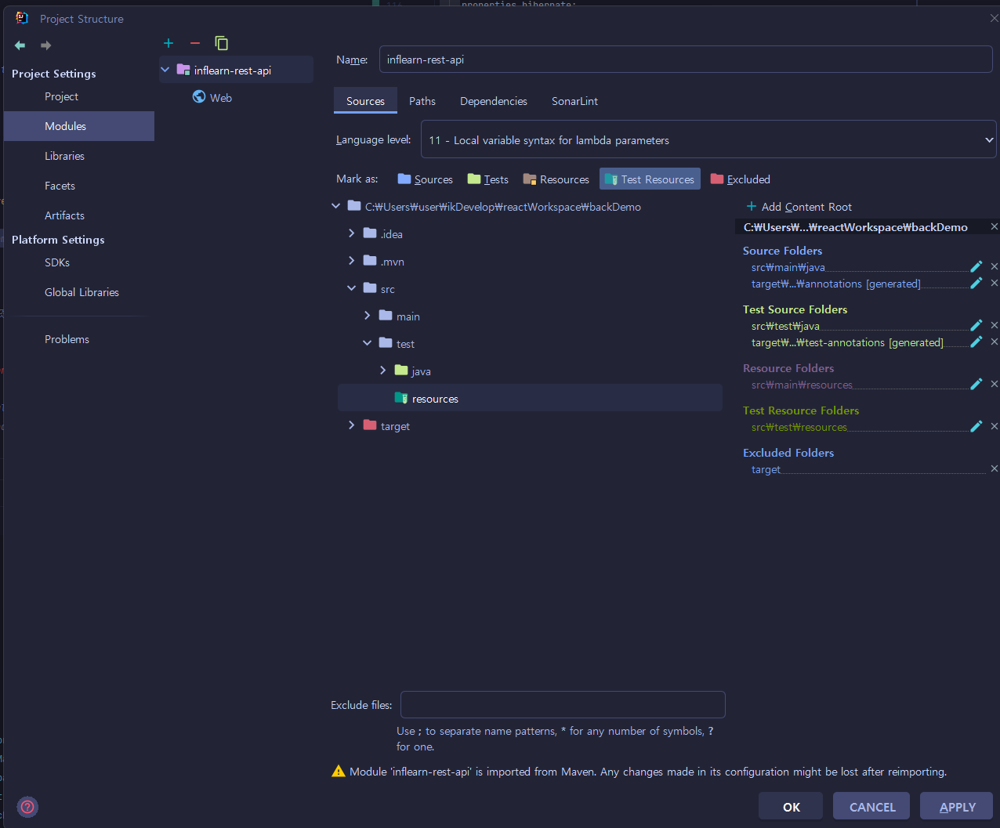

# Scripts

Here, I memo scripts that I have used during development.

## Postgres

### Run Postgres Container

```
docker run --name rest -p 5432:5432 -e POSTGRES_PASSWORD=pass -d postgres
```

    --name  : 컨테이너 이름
    -p      : port number
    -e      : 환경변수 설정
    -d      : 도커 이미지 이름

This cmdlet will create Postgres instance so that you can connect to a database with:
* database: postgres
* username: postgres
* password: pass
* post: 5432

기본정보(database,usename)를 변경하고 싶은 경우
```
docker run --name {containerName} -p {port} -e POSTGRES_DATABASE={databaseName} -e POSTGRES_USERNAME={username} -e POSTGRES_PASSWORD={password} -d {dockerImage} 
```

### Getting into the Postgres container

```
docker exec -i -t ndb bash
```
    exec    : command 실행
    -i      : interactive 모드
    -t      : 커맨드의 타겟 지정
    bash    : 명령어 종류

Then you will see the containers bash as a root user.

### change user to postgres
```
su - postgres
```


### Connect to a database
따로 설정하진 않고 기본적으로 유저의 이름임

```
psql -d postgres -U postgres
비밀번호 입력도 가능
psql -d postgres -U postgres -W  > password(위에 docker 설치했을때 설정한 환경변수)
```

### Query Databases
db 확인
```
\l
```

### Query Tables
최초 생성시에는 테이블이 없음
```
\dt
```

### Quit

```
\q
```
## pom.xml
1. 사용하던 h2 database dependency를 test scope로 변경
2. 운영db용으로 postgresql 의존성 추가
```
        <dependency>
            <groupId>org.postgresql</groupId>
            <artifactId>postgresql</artifactId>
        </dependency>
```
## application.properties(.yml)

### Datasource
```
> .properties
spring.datasource.username=postgres
spring.datasource.password=pass
spring.datasource.url=jdbc:postgresql://localhost:5432/postgres
spring.datasource.driver-class-name=org.postgresql.Driver

> .yml
datasource:
    url: jdbc:postgresql://localhost:5432/postgres
    username: postgres
    password: pass
    driver-class-name: org.postgresql.Driver
```

### Hibernate

```
> .properties
spring.jpa.hibernate.ddl-auto=create-drop
spring.jpa.properties.hibernate.jdbc.lob.non_contextual_creation=true
spring.jpa.properties.hibernate.format_sql=true

logging.level.org.hibernate.SQL=DEBUG
logging.level.org.hibernate.type.descriptor.sql.BasicBinder=TRACE

> .yml
spring:
  jpa:
    hibernate:
      ddl-auto: create-drop
    properties.hibernate:
        format_sql: true
        jdbc.lob.non_contextual_creation: true
        
logging:
  level:
    org.hibernate:
      sql: debug
      type.descriptor.sql.BasicBinder: trace

```

### Test Database
test 폴더의 resources에 application 설정정보를 넣고 test때 실행하도록 진행
```
spring.datasource.username=sa
spring.datasource.password=
spring.datasource.url=jdbc:h2:mem:testdb
spring.datasource.driver-class-name=org.h2.Driver
```

test resource 등록


source resource와 test resource의 이름이 같은 경우 프로세스가 소스 코드를 실행한 뒤 test 코드를 실행하기때문에 properties/yml 파일의 설정도 덮어씌우지게 된다. 
이를 위해 아래의 과정을 진행한다.

    1. test 설정파일에는 꼭 필요한 내용(test 때 쓸 내용)만 넣어서 override 때 설정이 바뀌지 않도록 적용
    2. test, develop, product마다 properties/yml 파일명을 다르게 기입
    3. test할 class 위에 @ActiveProfiles("test") 추가


