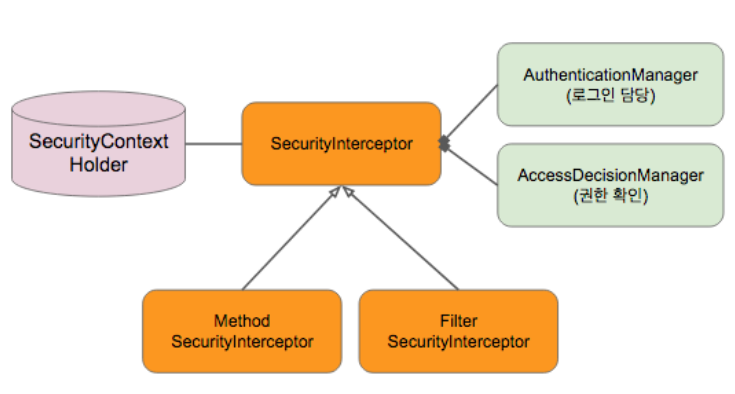
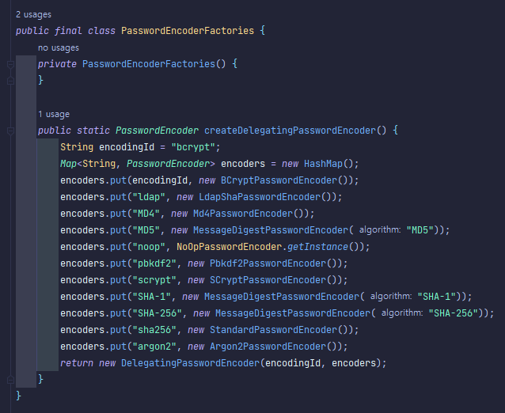

## A. 스프링 시큐리티
### 1. security 종류
| 종류       | 내용                            |
|----------|-------------------------------|
| 웹시큐리티    | 서블릿 기반(spring-webmvc)         |
|          | 웹플럭스기반(spring-webflux)/5.0 이후 |
| 메소드 시큐리티 | 웹과 관계없이 기능기반 시큐리티             |
* 모두 Security Interceptor 사용

가지고 있는 정보(resource)에 접근을 허가할지 결정
이번 프로젝트에서는 주로 웹 시큐리티 예정

### 2. 구현방식(간략한 설명)

한 스레드에서 처리하는 경우 [ThreadLocal](https://docs.oracle.com/javase/8/docs/api/java/lang/ThreadLocal.html) 구현체로 구현된 SecurityContextHolder에서 인증을 체크

#### a. UserDetailsService(유저 정보 검색)와 PasswordEncoder(비밀번호 매칭 체크)를 사용해 인증(Authentication) 진행
#### b. securityContextHolder에 인증 정보 보관
#### c. 권한(Authorization) 확인 : 유저 정보의 role 
#### d. 사용 인가(AccessDecison) 결정
## B. [시큐리티](https://docs.spring.io/spring-security/reference/getting-spring-security.html)

## C. 적용하기
### 1. 의존성 추가
```xml
<!-- https://mvnrepository.com/artifact/org.springframework.security.oauth.boot/spring-security-oauth2-autoconfigure -->
<dependency>
    <groupId>org.springframework.security.oauth.boot</groupId>
    <artifactId>spring-security-oauth2-autoconfigure</artifactId>
    <version>2.6.8</version>
</dependency>
```

=> 의존성을 추가한 순간 SpringBoot의 모든 테스트는 fail. 이에대한 설정이 필요하다.

계정을 등록하는 시점에서 passEcoder 등록
```java
    public Account saveAccount(Account account){
        account.setPassword(this.passwordEncoder.encode(account.getPassword()));
        return this.accountRepository.save(account);
    }
```
테스트때도 service를 사용하도록 변경
```java
    @Autowired
    PasswordEncoder passwordEncoder;

  @Test
  @DisplayName(value = "이름으로 유저정보 찾기")
  void findByUsername(){
          //given
          String username = "aaa@bbb.com";
          String password = "username";
          Account account = createUserData(username,password);
          this.accountService.saveAccount(account);
          //when
          UserDetailsService userDetailsService = accountService;
          UserDetails userDetails = userDetailsService.loadUserByUsername(username);
          //then
          assertThat(userDetails.getUsername()).isEqualTo(username);
          assertThat(this.passwordEncoder.matches(password,userDetails.getPassword())).isTrue();
  }
```


만약 로그로 security 관련사항이 보고싶다면 application.properties/yml에 로그수준 지정
```yaml
logging:
  level:
    org:
      springframework:
        security: DEBUG
```
### 2. 기본설정(필수!!)
#### a. 권한 배치 분류
- 로그인 없이 접근 가능: permitAll
- 비로그인만 접근 가능: isAnonymous
- 권한이 있는 사람만 : hasRole/hasAuthority or hasAnyRole/hasAnyAuthority
- 특정 IP : hasIpAddress
- 로그인한 사용자만 : rememberMe

  ...
ex)
```markdown
시큐리티 필터를 적용하기 않음...
/docs/index.html

로그인 없이 접근 가능
GET /api/events
GET /api/events/{id}

로그인 해야 접근 가능
나머지 다...
POST /api/events
PUT /api/events/{id{
...
```

#### b. 권한에 따른 SpringSecurity OAuth2.0 설정
```markdown
스프링 시큐리티 OAuth 2.0
- AuthorizationServer: OAuth2 토큰 발행(/oauth/token) 및 토큰 인증(/oauth/authorize)
    - Oder 0 (리소스 서버 보다 우선 순위가 높다.)
- ResourceServer: 리소스 요청 인증 처리 (OAuth 2 토큰 검사)
    - Oder 3 (이 값은 현재 고칠 수 없음)
```

#### c. 공통 설정(만료된 내용 주의)
설정 파일 만들기

legacy project에서는 */webapp/WEB-INF/spring*에서 .xml 파일로 관리함([예시 파일](security-context.xml)).

SpringBoot에서 Autoconfigurer를 사용했을 때( )
```java

@Configuration
@EnableWebSecurity //@EnableGlobalMethodSecurity, @EnableWebFluxSecurity도 가능
public class SecurityConfig extends WebSecurityConfigurerAdapter {//TODO 옛버전...만료됨 수정필요
    //사용할 의존성 주입
    private final AccountService accountService;
    private final PasswordEncoder passwordEncoder;
    //이곳에 정의한 설정만 적용
}
```

설정용 bean 설정
* legacy
  [web.xml](web.xml) 파일에 적용
* boot
  *Application.class 또느 Config.class(@Configuration)에 bean으로 설정
```java
@Configuration
public class AppConfig {
    @Bean
    public PasswordEncoder passwordEncoder(){
        return PasswordEncoderFactories.createDelegatingPasswordEncoder(); //다양한 비밀번호 인코더
    }
}
```
인코더 참조


#### d. 토큰 관리
예제용으로 TokenStore를 쓰지만 OAuth 버전이 올라가면서 deprecated 처리됨. 
우선 교육용으로 참고만하고 이후에 레디스 또는 다른 방법 고민 필요
- [2018 네이버 OAuth2.0 영상](https://tv.naver.com/v/4012597)
- [SpringSecurity Docs](https://docs.spring.io/spring-security/reference/getting-spring-security.html)
- [레디스로 구현한 블로그](https://velog.io/@minwest/Spring-Security-jwt%EB%A1%9C-%EB%A1%9C%EA%B7%B8%EC%9D%B8%EB%A1%9C%EA%B7%B8%EC%95%84%EC%9B%83-%EA%B5%AC%ED%98%84%ED%95%98%EA%B8%B0)

TokenStore: InMemoryTokenStore - 토큰을 보관할 Bean 생성
```java
    @Bean
    TokenStore tokenStore(){
        return new InMemoryTokenStore();
    }
```
AuthenticationManagerBean: 토큰 발행, 관리할 서버를 Bean으로 노툴
[에러 참고](https://stackoverflow.com/questions/61594513/while-try-to-authenticate-my-login-i-am-getting-error-handler-dispatch-failed)
```java
  @Bean(BeanIds.AUTHENTICATION_MANAGER)//AuthenticationManagerBean: 토큰 발행, 관리할 서버를 Bean으로 노툴
  @Override //method명 주의!!~!!authenticationManagerBean가 아님
  public AuthenticationManager authenticationManagerBean() throws Exception{
    return super.authenticationManagerBean();
  }

    @Bean
    @Override
    public AuthenticationManager authenticationManager() throws Exception {
        return super.authenticationManagerBean();
    }
```

#### e. 설정 진행 (Securityconfig.class)
- 토큰을 직접 생성하는 경우
```java
  @Value("${security.myKey}")
  private String SECRET_KEY;
  @Bean//AuthenticationManagerBean: 토큰 발행, 관리할 서버를 Bean으로 노툴
  @Override
  public AuthenticationManager authenticationManager() throws Exception {
      final OAuth2AuthenticationManager oAuth2AuthenticationManager = new OAuth2AuthenticationManager();
      oAuth2AuthenticationManager.setTokenServices(defaultTokenServices());
      return oAuth2AuthenticationManager;
  }
  @Bean
  public ResourceServerTokenServices defaultTokenServices() {
      final DefaultTokenServices defaultTokenServices = new DefaultTokenServices();
      defaultTokenServices.setTokenEnhancer(tokenEnhancerChain());
      defaultTokenServices.setTokenStore(tokenStore());
      return defaultTokenServices;
  }

  @Bean
  public JwtAccessTokenConverter tokenEnhancer() {
      final JwtAccessTokenConverter jwtAccessTokenConverter = new JwtAccessTokenConverter();
      jwtAccessTokenConverter.setSigningKey(SECRET_KEY);
      return jwtAccessTokenConverter;
  }
  @Bean
  public TokenEnhancerChain tokenEnhancerChain() {
      final TokenEnhancerChain tokenEnhancerChain = new TokenEnhancerChain();
      tokenEnhancerChain.setTokenEnhancers(List.of(new CustomTokenEnhancer(), tokenEnhancer()));
      return tokenEnhancerChain;
  }

  private static class CustomTokenEnhancer implements TokenEnhancer {
      @Override
      public OAuth2AccessToken enhance(OAuth2AccessToken accessToken, OAuth2Authentication authentication) {
          final DefaultOAuth2AccessToken result = new DefaultOAuth2AccessToken(accessToken);
          result.getAdditionalInformation().put("userId", accessToken.getAdditionalInformation().get("userId"));
//            result.getAdditionalInformation().put("companyId", accessToken.getAdditionalInformation().get("companyId"));
          return result;
      }
  }
```
- configure method 재정의

userDetailsService & passwordEncoder(AuthenticationManagerBuidler auth)
```java
    @Override
    protected void configure(AuthenticationManagerBuilder auth)throws Exception{
        auth.userDetailsService(accountService)     //사용할 서비스
                .passwordEncoder(passwordEncoder);  // 사용할 인코더
    }
```
#### f. 기본설정
security package 외부: docs와 기본적인 정적 자원들을 호출할때 security filter 사용 x
```java
    @Override
    public void configure(WebSecurity web) throws Exception{
        web.ignoring().mvcMatchers("/docs/index.html");// 안내
        web.ignoring().requestMatchers(PathRequest.toStaticResources().atCommonLocations());//springBoot제공 : 모든 정적 resources들의 기본위치
    }
```
security package 내부 : HttpSecurity http에서 anonymous 처리(필터는 처리함)

security filter는 진행하지만 보안처리는 안함.

처리는 안한다해도 결국 서버를 통과하므로 굳이 보안 처리가 필요없다면 외부에서 처리하는 filter 무시가 권장
```java
    @Override
    protected void configure(HttpSecurity http)throws Exception{
        http.authorizeRequests()
                .mvcMatchers("/docs/index.html").anonymous()
                .requestMatchers(PathRequest.toStaticResources().atCommonLocations()).anonymous()
        ;
    }
```
#### g. HttpSecurity를 사용해 정밀하게 체크
```java
    @Override
    protected void configure(HttpSecurity http)throws Exception{
        http.anonymous()//비인증 접근 허용
                .and()//설정 병렬로 지정
            .formLogin()//form login 설정
                .loginPage()//로그인 페이지 url
                .passwordParameter()//파라미터명
                .usernameParameter()
                .failureForwardUrl()//실패시 이동시킬 url
                .successForwardUrl()//성공시 이동시킬 url
                //안해도 자동처리됨. 테스트용에서는 처리 안해도 기본페이지 제공
                .and()
            .authorizeRequests()//요청에 대한 처리지정
                .mvcMatchers(HttpMethod.GET,"/api/**").permitAll() // 해당 /api/를 포함한 Get method 요청은 비로그인으로 처리
                .anyRequest().authenticated();//그 외 나머지 요청은 다 요청
    }
```
## D. OAuth2 인증서버 
### 1. 목적
  - 테스트 때 토큰 발행, 토큰관리 
### 2. 인증 방식
#### a. 일반적인 인증(외부 업체(first party)를 통한 인증)
고객 계정이 인증 요청 > 인증정보를 가진 서버(like google, kakao, naver...etc.)로 redirection > 정보 제공자의 token(access, refresh)으로 고객정보 재요청 > 정보를 받아 처리
#### b. 자체 인증관리
[참조문서](https://developer.okta.com/blog/2018/06/29/what-is-the-oauth2-password-grant)
직접 인증을 처리하는 경우의 방식(이 프로젝트는 옛방식)

but [새로 업데이트된 내용 참조](https://oauth.net/2/)
### 3. 의존성 주입
```xml
  <dependency>
      <groupId>org.springframework.security</groupId>
      <artifactId>spring-security-test</artifactId>
      <version>${spring-security.version}</version>
      <scope>test</scope>
  </dependency>
```
### 4. 내용 작성
#### a. test code 작성
```java
    @Test
    @DisplayName(value = "인증토큰(accessToken, refreshToken)을 발급받는다.")
    void getToken() throws Exception {
        //given
        String email="abc@def.com";
        String password ="abc";
        Account account = createUserData(email,password);
        this.accountService.saveAccount(account);

        String client_id = "myApp";
        String client_secret = "passwd";
        //when
        ResultActions perform = this.mockMvc.perform(post("/oauth/token")
                .with(httpBasic(client_id,client_secret))// request header 생성
                .param("username",email)//인증 정보 삽입
                .param("password",password)
                .param("grant_type","password")
        );//기본으로 제공될 handler
        //then
            perform.andExpect(status().isOk())
            .andDo(print())
            .andExpect(jsonPath("access_token").exists())
            .andExpect(jsonPath("refresh_token").isNotEmpty())
            .andExpect(jsonPath("token_type").value("bearer"))
            .andExpect(jsonPath("expires_in").isNumber())
            .andExpect(jsonPath("scope").value("read write"))
            ;
    }
```
#### b. config class(AuthServerConfig.class)
security, clients, endpoint 설정
```java
@Configuration
@EnableAuthorizationServer
@RequiredArgsConstructor
public class AuthServerConfig extends AuthorizationServerConfigurerAdapter {
  private final PasswordEncoder passwordEncoder;
  private final AuthenticationManager authenticationManager;
  private final AccountService accountService;
  private final TokenStore tokenStore;
  @Override
  public void configure(AuthorizationServerSecurityConfigurer security) throws Exception {
      security.passwordEncoder(passwordEncoder);//client_secret을 처리할때
  }

  @Override
  public void configure(ClientDetailsServiceConfigurer clients) throws Exception {
      clients.inMemory()//test용 실무에서는 .jdbc로 db처리
              .withClient("myApp")//client_id
              .authorizedGrantTypes("password","refresh_token")//grant_type
              .scopes("read","write")//app에서 정의한 범위
              .secret(this.passwordEncoder.encode("passwd"))//client_secret
              .accessTokenValiditySeconds(10 * 60)//토큰 만료시간(sec)
              .refreshTokenValiditySeconds(6 * 10 * 60);
  }
  @Override
  public void configure(AuthorizationServerEndpointsConfigurer endpoints) throws Exception {
    endpoints.authenticationManager(authenticationManager)//authentication처리때 사용할 이전에 등록한 bean 등록
            .userDetailsService(accountService)
            .tokenStore(tokenStore);
  }
```
#### c. resources 설정
```java
    @Override
    protected void configure(HttpSecurity http)throws Exception{
        http.anonymous()//비인증 접근 허용
                .and()//설정 병렬로 지정
            .formLogin()//form login 설정
//                .loginPage()//로그인 페이지 url
//                .passwordParameter()//파라미터명
//                .usernameParameter()
//                .failureForwardUrl()//실패시 이동시킬 url
//                .successForwardUrl()//성공시 이동시킬 url
                //안해도 자동처리됨. 테스트용에서는 처리 안해도 기본페이지 제공
                .and()
//            .csrf().disable()//CSRF 방지
            .authorizeRequests()//요청에 대한 처리지정
                .mvcMatchers(HttpMethod.GET,"/api/**").permitAll() // 해당 /api/를 포함한 Get method 요청은 비로그인으로 처리
                .anyRequest().authenticated()//그 외 나머지 요청은 다 요청
        //JWT를 사용할 경우
//            .formLogin().disable()//form login 설정
//            .addFilterBefore(new JwtAuthenticationFilter(jwtTokenProvider), UsernamePasswordAuthenticationFilter.class)
            ;
    }
```

## E. Resource 접근 제한(ResourceServerConfig.class)
### 1. 목적
리소스에 대한 접근 제어를 담당. 토큰의 유효성을 체크해서 처리
### 2. 담당 Config class 만들기
```java
@Configuration
@EnableResourceServer
public class ResourceServerConfig extends ResourceServerConfigurerAdapter {
    @Override //resource의 id를 설정
    public void configure(ResourceServerSecurityConfigurer resources) throws Exception {
        super.configure(resources);
    }

    @Override
    public void configure(HttpSecurity http) throws Exception {
        super.configure(http);
    }
}
```
### 3. resource id(http는 security와 동일)
```java
    @Override //resource의 id를 설정
    public void configure(ResourceServerSecurityConfigurer resources) throws Exception {
        resources.resourceId("event");//설정하지 않은 부분은 기본설정으로 유지됨
    }

    @Override
    public void configure(HttpSecurity http) throws Exception {
        http.anonymous()
                .and()
//                .csrf().disable()
            .authorizeRequests()
                .mvcMatchers(HttpMethod.GET, "/api/**").permitAll()
                .anyRequest().authenticated()
                .and()
            .exceptionHandling()//에러가난 경우 처리를 OAuth2의 핸들러에 맡김
                .accessDeniedHandler(new OAuth2AccessDeniedHandler());
    }
```

### 4. 인증 절차가 필요한 요청에 token 처리 추가
현재 get요청은 annoymous가 가능. 그외 요청에만 처리
```java
  mockMvc.perform(post("/api/events")//HTTPRequestServlet Method
        .header(HttpHeaders.AUTHORIZATION, "Barer "+getAuth())
        .contentType(MediaType.APPLICATION_JSON) // request 구체적 구현
        .accept(MediaTypes.HAL_JSON) 
        ...
```
토큰 테스트에서 썼던 것을 가져와 토큰을 반환하도록 처리
```java
    private String getAuth() throws Exception {
        String email="abc@def.com";
        String password ="abc";
        Account temp = Account.builder()
                .email(email)
                .password(password)
                .roles(Set.of(AccountRole.USER, AccountRole.ADMOIN))
                .build();
        Account account = this.accountService.saveAccount(temp);

        String client_id = "myapp";
        String client_secret = "1";
        //when
        ResultActions perform = this.mockMvc.perform(post("/oauth/token")//url은 자동처리
                .with(httpBasic(client_id, client_secret))// request header 생성
                .param("username",email)//인증 정보 삽입
                .param("password",password)
                .param("grant_type","password")
        );//기본으로 제공될 handler
        String responseStr = perform.andReturn().getResponse().getContentAsString();
        Jackson2JsonParser parser = new Jackson2JsonParser();
        return parser.parseMap(responseStr).get("access_token").toString();
    }
```

## D. Tips...
### 1. 권한을 처리할때
Set을 SimpleGrantedAutority로 변환
```java
//UserDetails를 반환할때
        return new User(account.getEmail(),account.getPassword(),setAuthorities(account.getRoles()));

//변환 method 예시
    private Collection<? extends GrantedAuthority> setAuthorities(Set<AccountRole> roles) {
        return roles.stream().map(r->new SimpleGrantedAuthority("ROLE_"+r.name())).collect(Collectors.toSet());
    }
```
### 2.  Security를 적용한 후 매번 회원가입이 귀찮을때
application이 동작할때 계정을 생성하도록 처리
```java
    @Bean
    public ApplicationRunner applicationRunner(){    // 서버가 시작할때 반드시 해야할 동작이 있는 경우 구현
        return new ApplicationRunner() {
            // Test용.. 기존사용자를 매번 만들경우
            @Autowired
            AccountService accountService;
            @Override
            public void run(ApplicationArguments args) throws Exception {
                Account testAccount = Account.builder()
                        .email("dream-ik89@naver.com")
                        .password("l123")
                        .roles(Set.of(AccountRole.USER, AccountRole.ADMOIN))
                        .build();
                accountService.saveAccount(testAccount);
                Account userAccount = Account.builder()
                        .email("natural@user.com")
                        .password("l123")
                        .roles(Set.of(AccountRole.USER))
                        .build();
                accountService.saveAccount(userAccount);
                Account adminAccount = Account.builder()
                        .email("admin@user.com")
                        .password("l123")
                        .roles(Set.of(AccountRole.USER, AccountRole.ADMOIN))
                        .build();
                accountService.saveAccount(adminAccount);
            }
        };
    }
```
단순 테스트용일뿐... 반복적으로 테스트가 일어날 경우 에러 발생
Entity에서 중복을 방지할 경우 Column에 설정 추가
```java
    @Column(unique = true)
    private String email;
```

### 3. applicationContext를 공유하는 여러 테스트를 할때 duplicate 에러가 날수있음
inMemory로 처리해도 Context를 공유하는 경우를 위해 전처리 진행 
```java
    @BeforeEach //Junit5
    void beforeEach(){
        //각 method 실행전에 db 비우기
        eventRepository.deleteAll();
        accountRepository.deleteAll();
    }
    
    @Before//JUnit 4
    public void beforeEach(){
            //각 method 실행전에 db 비우기
            eventRepository.deleteAll();
            accountRepository.deleteAll();
            }
```
